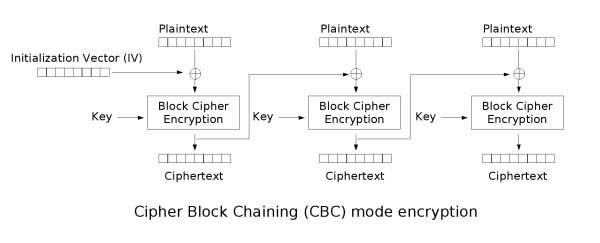

# AE-no

The AES key can be public as long as the IV is secret right?

## Challenge

We are given two files here:

`main.py`
```python
from Crypto.Cipher import AES
from Crypto.Util.Padding import pad
from os import urandom
from secret import flag

def main():
  iv = urandom(16)
  key = b'SecretKey1234567'
  msg = b'Here is the flag for you: ' + flag
  cipher = AES.new(key, AES.MODE_CBC, iv)
  enc = cipher.encrypt(pad(msg,16))
  print("Key: " + key.decode())
  print("Encoded Flag: " + enc.hex())

if __name__ == '__main__': main()
```

`out.txt`
```
Key: SecretKey1234567
Encoded Flag: 96a0299d6c60cd0f40218b73ab5fc4b710b8951bd0ed8977a1382328454a2ce68106660bb48808c2fa7a141ac863732f66f9032d00cf2c0ecc3a6871683911a6
```

Upon looking at the source code we can see a standard `AES-CBC` encryption is happening. We also see that we have partial plaintext as well as the key used for the encryption. The only thing we are missing is the iv.

So the problem really comes down to just recovering the iv. Well lets think about how CBC works.



Here we can see that the way `AES-CBC` works is that it xors first block of `plaintext` with the `iv` and then encrypts it with a `key`. How is this helpful to us?

Well, since we have the key, the first block of plaintext, and the first block of ciphertext, we can use this to obtain the xor of plaintext and iv.

```python
cipher = AES.new(b'SecretKey1234567', AES.MODE_CBC)
decrypted_block = cipher.decrypt(bytes.fromhex("96a0299d6c60cd0f40218b73ab5fc4b7"))
```
Using the key here and the first block of ciphertext (16 bytes or 32 hex characters), we will decrypt it to get the plaintext xored with iv. Then from here all we need to do is xor that with the first 16 bytes of plaintext to obtain our iv.

```python
iv = bytes([x ^ y for x, y in zip(decrypted_block, b'Here is the flag')])
```

Then from there we can decrypt the rest of the ciphertext.

```python
from Crypto.Cipher import AES
from Crypto.Util.Padding import pad
from os import urandom
#from secret import flag

#Obtaining IV
cipher = AES.new(b'SecretKey1234567', AES.MODE_CBC)
decrypted_block = cipher.decrypt(bytes.fromhex("96a0299d6c60cd0f40218b73ab5fc4b7"))
iv = bytes([x ^ y for x, y in zip(decrypted_block, b'Here is the flag')])
#Decryption
cipher = AES.new(b'SecretKey1234567', AES.MODE_CBC, iv)
print(cipher.decrypt(bytes.fromhex("96a0299d6c60cd0f40218b73ab5fc4b710b8951bd0ed8977a1382328454a2ce68106660bb48808c2fa7a141ac863732f66f9032d00cf2c0ecc3a6871683911a6")))
```

## Flag

`SIVBGR{IV_B33n_H3r3_B3f0r3}`