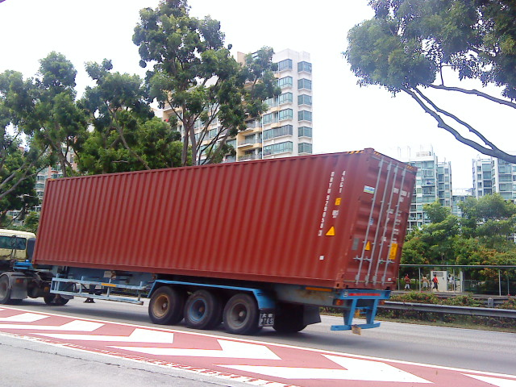
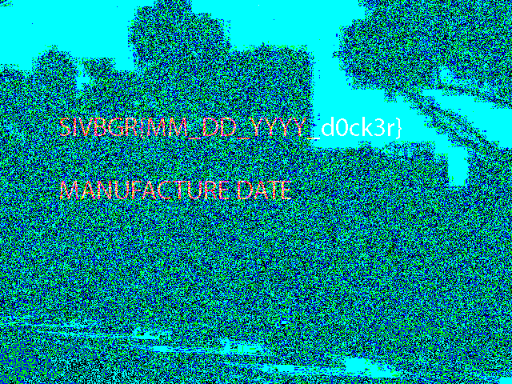

# Container Chronicles

Welcome, aspiring digital detectives, to the Container Chronicles challenge! Your mission, should you choose to accept it, is to delve into the depths of a seemingly ordinary image of a shipping container and uncover its hidden secrets.

Within the confines of this digital cargo hold lies a treasure trove of information waiting to be unearthed. Your task revolves around deciphering the manufacturing date of the shipping container concealed within the image. But beware, for the information you seek is not readily visible to the naked eye.

Utilizing your skills, you must meticulously examine every pixel, every byte, and every hidden layer within the image to extract the elusive manufacturing date. Employ various techniques, ranging from simple visual inspection to advanced data analysis, to uncover the truth lurking beneath the surface.

Remember, in the world of digital forensics, every detail matters. Stay vigilant, think outside the box, and be prepared to embark on a journey through the intricate labyrinth of data concealed within the confines of this innocuous image.

Are you ready to unravel the mysteries of the Container Chronicles? The fate of the cargo rests in your hands. Good luck, and may the digital winds guide you to victory!

## Challenge

For this challenge we were given a picture of a shipping container in transit:



Based off the challenge description there was obviously some steganography involved here so throwing it into [Aperi'Solve](https://www.aperisolve.com/):



We found a little hint here that gives us the flag format and what to look for. So now we know that the flag is `SIVBGR{MM_DD_YYYY_d0ck3r}`, where the date is the manufacture date.

After doing some researching about the labels on containers I found this:
```
Container numbers have the format XXXU1234567
- We use the first 4 letters to automatically send the request to the correct company
- If the company is not supported or you want to select a specific company you can do this manually after tracking
```

Zooming in on the first picture and trying to make out that container number, I was able to use [this](https://www.track-trace.com/container) to plug in some potential numbers and found a match. The number `DRYU9290583` was returning a positive, meaning that it existed.

Some more research will tell you that the company assosciated with `DRY` is `SeaCube`. Going to there site we can find something to lookup containers [here](https://seacube.intermodalportal.com/).

Looking up `DRYU9290583` yields us this information:
```
 DRYU9290583
General Information: 	
Type: 	D40HC (40' High-cube Dry)
Current/Last Location: 	Destroyed / Total Loss (Administrative Location)
Latest Move Status: 	OFF-HIRE
Latest Move Date: 	6/9/2015
Last Off Hire Date: 	6/9/2015
Manufacture Date: 	2/10/2011
Box / Chz Mfg: 	CIMC SLEM
Box / Chz Mfg Yr: 	2011
Reefer / Gset Mfg: 	
Reefer / Gset Model: 	
 
Customer Information: 	
Lessee: 	Evergreen Marine Corporation (EVMC)
Contract: 	EVMC007A
 
Technical Information: 	
External Length: 	12,192 mm
External Width: 	2,438 mm
External Height: 	2,896 mm
Internal Length: 	12,032 mm
Internal Width: 	2,352 mm
Internal Height: 	2,698 mm
Internal Door Width: 	2,340 mm
Internal Door Height: 	2,585 mm
Tare Weight: 	3,820 kg
Payload Weight: 	28,680 kg
Maximum Weight: 	32,500 kg
Capacity: 	0 cubic meters
```

Which has the information we need for the flag!

## Flag

`SIVBGR{02_10_2011_d0ck3r}`