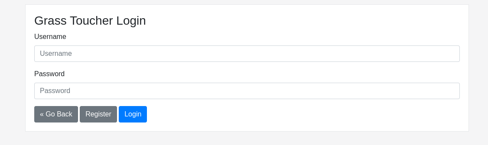
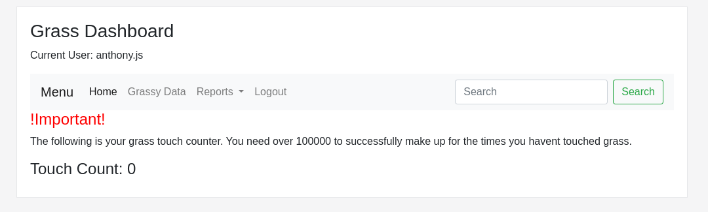
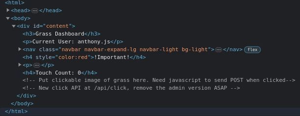

# Touch-Grass

ARIA has ordered you to touch grass. Now you actually have to do it. Make up for all the times you havent touched it.

https://uscybercombine-touch-grass.chals.io/ 

## Challenge

Jumping right into the website, we can take a look around. Looking at the base url there really isnt any functionality except for when we click on `Grass Dashboard` which takes us to https://uscybercombine-touch-grass.chals.io/login:



From here we can try and fuzz the login a little bit and see if we can get an admin login, but after a while of fiddling with it I came up with nothing. So from there I decided to try out the register button.

After registering we are greeting with this:



Clicking around here there was no functionality to be found. Opening up the html source code allowed us to spot this line:



Here we can see two things. We see the hint at a `/api/click` end point and we also see that there is a `admin version`.

With some poking around you will discover that you can send a `POST` request to `/api/click` and it will increase your click counter by one. And we know by the dashboard that in order to recieve the flag we need to get over 100,000. Now some people tried to automate this by just sending a ton of requests for a long period of time but I would rather not do that lol.

From here I took a step back and began to look at the requests that we have sent to the server already. Just briefly going through the requests that were received in the registering process I came across this one `/static/js/register.js`.

```javascript
HTTP/1.1 200 OK
Server: Werkzeug/3.0.3 Python/3.12.3
Date: Thu, 13 Jun 2024 18:09:41 GMT
Content-Disposition: inline; filename=register.js
Content-Type: text/javascript; charset=utf-8
Content-Length: 1330
Last-Modified: Sun, 02 Jun 2024 02:17:23 GMT
Cache-Control: no-cache
ETag: "1717294643.0-1330-3549500124"
Date: Thu, 13 Jun 2024 18:09:41 GMT
Connection: close

$(document).ready(function() {
	$('#register_button').on('click', register);
    console.log("ready");
});

const register = async() => {
	$('#register_button').prop('disabled', true);

	// prepare alert
	let card = $("#resp-msg");
	card.attr("class", "alert alert-info");
	card.text("Sending registration...");
	card.show();

	// validate
	let username = $("#username").val();
	let first_name = $("#first_name").val();
    let last_name = $("#last_name").val();
	let password = $("#password").val();

	await fetch(`/api/register`, {
		// copy from the /admin/api/register endpoint
			method: 'POST',
			headers: {
				'Content-Type': 'application/json',
			},
			body: JSON.stringify({username: username, first_name: first_name, last_name: last_name, password: password}),
		})
		.then((response) => response.json()
			.then((resp) => {
				card.attr("class", "alert alert-danger");
				if (response.status == 200) {
					card.attr("class", "alert alert-info");
					card.text(resp.message);
					card.show();
                    window.location = "/dashboard";
				}
				card.text(resp.message);
				card.show();
			}))
		.catch((error) => {
			card.text(error);
			card.attr("class", "alert alert-danger");
			card.show();
		});

		$('#register_button').prop('disabled', false);
}
```
I've added some color to it so you can see just how easily I was able to pick out this line:
```javascript
await fetch(`/api/register`, {
		// copy from the /admin/api/register endpoint
			method: 'POST',
			headers: {
				'Content-Type': 'application/json',
			},
			body: JSON.stringify({username: username, first_name: first_name, last_name: last_name, password: password}),
		})
```

So this pretty easily points us in the right direction. After some playing around, you can find out that when you try to access the `/admin/api/register` endpoint without being logged in, you are redirected to the login page. But after logging in, you can successfully send a POST request to it.

We can assume that the format will be exactly the same as `/api/register` since it was copied from the admin endpoint. So sending the almost exact same request from `/api/register` to `/admin/api/register`, with an addition of a cookie, we get this.

```
HTTP/1.1 200 OK
Server: Werkzeug/3.0.3 Python/3.12.3
Date: Thu, 13 Jun 2024 18:18:26 GMT
Content-Type: application/json
Content-Length: 39
Vary: Cookie
Set-Cookie: session=GvY2MOfKAvwod_bJA6rooG_ddfb7iC7bpLQxSbaERRg; HttpOnly; Path=/
Connection: close

{"message":"Registration successful."}
```

Now if we remember to back when we inspected the html and found the `/api/click` endpoint, there was mention that there was an admin version. Poking around some more we can find the `/admin/api/click` endpoint.

Sending a POST request to that endpoint, with the username used to signup at `/admin/api/register`, we get this result:
```
HTTP/1.1 400 BAD REQUEST
Server: Werkzeug/3.0.3 Python/3.12.3
Date: Thu, 13 Jun 2024 18:21:29 GMT
Content-Type: application/json
Content-Length: 38
Vary: Cookie
Connection: close

{"message":"Missing count Parameter"}
```

Adding a count parameter with value `100,000` we get:

```
HTTP/1.1 200 OK
Server: Werkzeug/3.0.3 Python/3.12.3
Date: Thu, 13 Jun 2024 18:22:45 GMT
Content-Type: application/json
Content-Length: 29
Vary: Cookie
Connection: close

{"message":"Count updated."}
```

Then returning to the dashboard logged into the admin account we receive the flag!

## Flag

`SIVBGR{T0uch_1t}`
